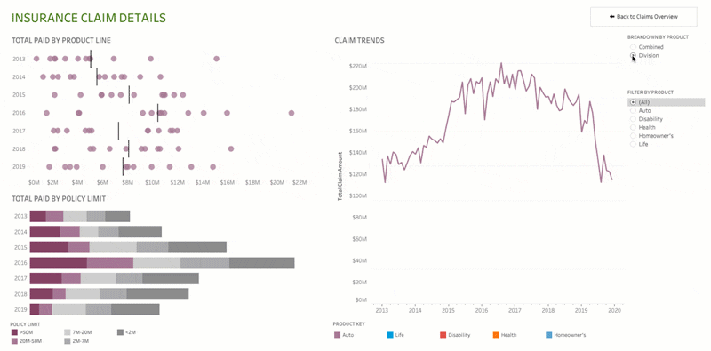

  

  
  
  

━━━━━━━━━━━━━━━━━━━━━━━━━━━━━━━━━━━━━━━━━━━━━━━━━━━━━━━━━━━━━━━━━━━━━━━━━━━━━━━━━━━

<h1 align = "center"> 👋 Hola Mundo mi nombre es Ricardo</h1>

  📊 Economista |  🧮 Data Analyst | Statistics | Excel | Power BI | Pythom | R | 🤖 Ingeniero en Ciencias de Datos e Inteligencia Artificial en curso.  

## 🧠 Sobre mi
Tengo experiencia en gestión financiera, contable y administrativa. Me gusta trabajar con datos, descubrir su patrones, tendencias y causalidades. En los últimos años he desarrollado de forma autodidacta habilidades en reportería. Además de mi trabajo profesional, me encanta el senderismo, motociclismo y la música, especialmente el rock e indie y la música antigua que escuchaba mi padre. Mi terapía correr en pista, gimnasio y cuidar de mis plantas🪴 y árboles🌳.

━━━━━━━━━━━━━━━━━━━━━━━━━━━━━━━━━━━━━━━━━━━━━━━━━━━━━━━━━━━━━━━━━━━━━━━━━━━━━━━━━━━

### 🚀 Proyectos y metas actuales
- 🔭 Actualmente estoy recopilando información para presentar mis proyectos en mis redes sociales.
- 🌱 Estoy cursando la carrera de ingenieria en ciencias de datos e inteligencia artificial. 
- 👯 A futuro quiero colaborar con personas que realicen tutoriales relacionadas a data science. 
- 🤔 Necesito ayuda para perder el miedo a la camara y realizar mis videos 😬.  
- 💬 Pregúntame sobre matemáticas y estadística. 
- 📫 Puedes ponerte en contacto conmigo a mi correro electrónico ricardo.matabays@gmail.com
- 😄 Pronouns: él
- ⚡ Fun fact: "Los humanos no son individuos, sino dividuos. Debido a que, son influenciados por muchos algoritmos diferentes que hace que carezcan de una voz interior."

<!--
**Ricardomasi/Ricardomasi** is a ✨ _special_ ✨ repository because its `README.md` (this file) appears on your GitHub profile.
Here are some ideas to get you started:-->
